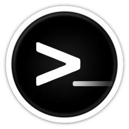

# Configfájlok
Linux konfigurációs fájlok. 

Itt találhatsz a rendszerhez, programokhoz olyan konfigurációs fájlokat, melyek öteletet adhat a sajátod összeállításánál.

Jelenleg a következőkhöz találsz mintákat:

 **Bash** parancsértelmező
 - https://www.gnu.org/software/bash/

 **QTile** ablakkezelő
 - http://www.qtile.org/

 **Rofi** menü
 - https://github.com/davatorium/rofi

 **ViM** szerkesztő
 - https://www.vim.org/

