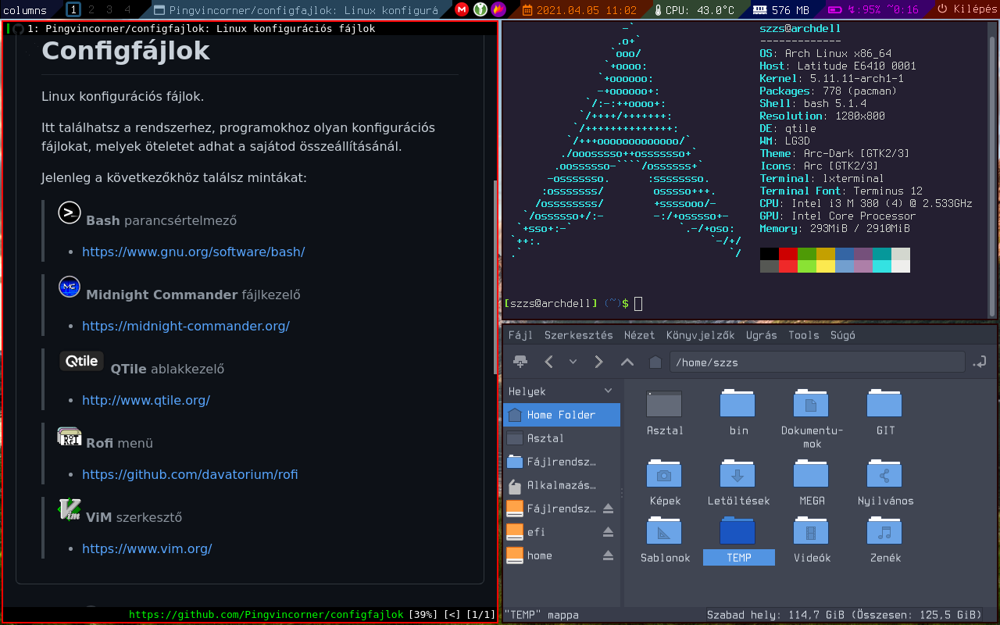
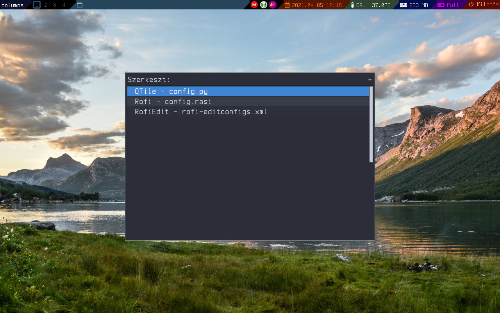

## QTile konfig



### A konfigurációs fájlokban feltételezett csomagok
Betűtípus:
- terminus-font
- ttf-font-awesome
- awesome-terminal-fonts

Program:
- htop
- lm_sensors
- lxterminal
- networkmanager *(nmtui-edit, nmtui-connect)*
- nitrogen
- pulseaudio
- python-psutil
- rofi

### Módosítások a gyári alaphoz képest

- Induláskor végrehajtja a "$HOME/bin/autostart.sh" scriptet az autostart programok indításához.
- Bar a képernyő tetején, nem az alján.
- Az aktív ablakot nem állítja át az egérkurzor mozgatása - *follow_mouse_focus = False*
- 9 helyett 4 virtuális asztal.
- Természetesen a Widget-ek módosítva, újak felvéve.

### Módosított billentyű kombinációk

- Az ablak kezelő (*alap: ViM kiosztás*) billentyűk áttéve a nyíl billentyűkre.
- [mod]+Q  - Ablak bezárása


### Új billentyű kombinációk

- XF86AudioRaiseVolume - Hangerő növelése
- XF86AudioLowerVolume - Hangerő csökkentése
- XF86AudioMute - Hang némítása
- A [mod]+[Bármyelyik hangvezérlő billentyű] elindítja a `pavucontrol` programot.
- A [mod]+c elindítja terminálban a 'Csatlakozás hálózathoz' programot (`nmtui-connect`).
- A [mod]+shift+c elindítja terminálban a 'Hálózati kapcsolatok szerkesztése' programot (`nmtui-edit`).
- [mod]+shift+f  - Aktív ablak lebegő mód be- kikapcsolása.
- [mod]+e - Futtat egy python scriptet, ami megjeleníti a`rofi` menüt, amiben konfig fájlok szerkesztésére nyílik lehetőség.<br/>*[lásd lejebb: Rofi Scripts]*

### Widget-ek
- widget.Clock - Kattintásra elindul a `cal` terminál parancs, ami egy naptárat jelenít meg.
- widget.Memory - Kattintásra futtatja a `htop` programot.


### Rofi Scripts
#### rofi-editconfigs.py
Megjelenít egy speciális `rofi` menüt, melyekben fel vannak sorolva a felhasználó által megszabott konfigurációs fájlok, majd kiválasztás esetén megnyitja azt az előre meghatározott szövegszerkesztőben.


A rofi-editconfigs.py scriptet a `$HOME/bin/rofi-scripts` könyvtárban feltételezi a QTile konfig fájlban (config.py) található `ShowRofi_Editors` függvény.
```
mkdir -p $HOME/bin/rofi-scripts
cp rofi-editconfigs.py $HOME/bin/rofi-scripts/
```
A `rofi-editconfigs.py` script betölti a felhasználó által szerkesztendő `rofi-editconfigs.xml` fájlt, ami a beállításokat tartalmazza.
A `rofi-editconfigs.xml` fájlt a `rofi-editconfigs.py` script a `$HOME/.config/rofi/` könyvtárban keresi.
```
mkdir -p $HOME/.config/rofi
cp rofi-editconfigs.xml $HOME/.config/rofi
```

